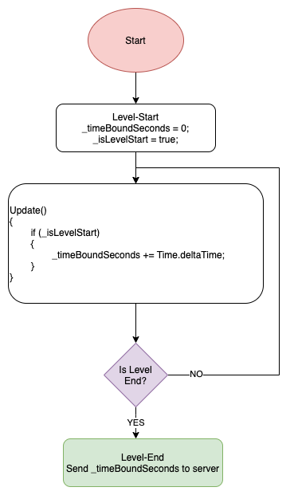

# I. Introduction

## 1. Goals
1. Centralize Analytics Logic.
2. Easy to hire developer to develop games, they don't care about 3rd-party Analytics SDKs.
3. Easy to us for Enable/Disable 3rd-party SDK. Just use [Script Define Symbols](https://docs.unity3d.com/Manual/PlatformDependentCompilation.html)
4. Easy to add more 3rd-party SDK when we need more. Just implement in Reposotory-Layer. => We do not depend on Game Developer.

## 2. How does it works?
1. The Core of the Game use one easy API SET to record events and user's properties.
2. The Analysis Core send them (events + properties) to many 3rd-party that is desired.


# II. Analysis

## 1. User Behavior Analysis

### 1.1 Definitions
1. Node: A node is an interactable component on the Game Scene. It can be a Button, an Image, a Lable, etc.
2. Edge: It is an ***Transition*** from a ***Node*** to ***Another Node***. An Edge will contains 3 parameters:

```
{
  "node": "The current node-name",
  "src": "The source that the user interact before",
  "time_bound": "miliseconds - the time moving between [src, node]"
}
```
### 1.2 Implementation
1. Add ***ButtonAnalysisBehaviour*** into your Button in the Game Scene
2. Or implment the below code in your custom function

```
private void onButtonClicked()
{
    RealbizGames.Analysis.ButtonAnalysisDTO dto = new RealbizGames.Analysis.ButtonAnalysisDTO(ButtonName);
    RealbizGames.Analysis.AnalysisInstance.Instance.AnalysisService.Button_Click(dto);
}
```
## 2. Game Flow Analysis

### 2.1 Scene Flow Analysis
Please attack our script SceneAnalysisBehavior into target Scene or a Layer of the Scene for Auto-Tracking. Or manual implement below code if you want.

```
private void sceneStart() {
    _timeBoundSeconds = 0;

    RealbizGames.Analysis.SceneStartDTO dto = new RealbizGames.Analysis.SceneStartDTO(SceneName);
    RealbizGames.Analysis.AnalysisInstance.Instance.AnalysisService.Scene_Start(dto);
}
```
And, when the scene-end, please call:
```
private void sceneEnd() {
    RealbizGames.Analysis.SceneEndDTO dto = new RealbizGames.Analysis.SceneEndDTO(SceneName, _timeBoundSeconds);
    RealbizGames.Analysis.AnalysisInstance.Instance.AnalysisService.Scene_End(dto);
}
```
### 2.2 Dialog Flow Analysis
The same with "Scene Flow Analysis", You must to call 2 functions like it.
```
private void dialogStart() {
    _timeBoundSeconds = 0;

    RealbizGames.Analysis.DialogStartDTO dto = new RealbizGames.Analysis.DialogStartDTO(DialogName);
    RealbizGames.Analysis.AnalysisInstance.Instance.AnalysisService.Dialog_Start(dto);
}
```
And when the dialog hide, We have to call:
```
private void dialogEnd() {
    RealbizGames.Analysis.DialogEndDTO dto = new RealbizGames.Analysis.DialogEndDTO(DialogName, _timeBoundSeconds);
    RealbizGames.Analysis.AnalysisInstance.Instance.AnalysisService.Dialog_End(dto);
}
```
The variable ***_timeBoundSeconds***, it must be count in ***Update()*** function. Like the code below.
```
void Update()
{
    _timeBoundSeconds += Time.deltaTime;
}
```
### 2.3 Tutorial Flow Analysis
```
private void tutorialBegin() {
    _timeBoundSeconds = 0;

    RealbizGames.Analysis.TutorialBeginDTO dto = new RealbizGames.Analysis.TutorialBeginDTO(TutorialName);
    RealbizGames.Analysis.AnalysisInstance.Instance.AnalysisService.Tutorial_Begin(dto);
}
```

```
private void tutorialComplete() {
    RealbizGames.Analysis.TutorialCompleteDTO dto = new RealbizGames.Analysis.TutorialCompleteDTO(TutorialName, _timeBoundSeconds);
    RealbizGames.Analysis.AnalysisInstance.Instance.AnalysisService.Tutorial_Complete(dto);
}
```
### 2.4 Level Flow Analysis
We have to functions to implement:
1. level-start: It has only one required param that is level-name. Some other games can add more with their custom values.
2. level-end: It has two required params [level-name + time-bound-seconds]

In some games. They are endless game. They only have one level. What is your level-name?

We need to answer the two questions below:
> How did your user play the level?
> Do their playing skill improve level by level?

So, to have this param level-name, we just use user-play-level-count to used as level-name. When a user complete/lose the endless level, we increase the counter by 1. After that, use the counter as level-name.

```
private void levelStart() {
    _timeBoundSeconds = 0;

    RealbizGames.Analysis.LevelStartDTO dto = new RealbizGames.Analysis.LevelStartDTO(LevelName);
    RealbizGames.Analysis.AnalysisInstance.Instance.AnalysisService.Level_Start(dto);
}
```

```
private void levelEnd() {
    RealbizGames.Analysis.LevelEndDTO dto = new RealbizGames.Analysis.LevelEndDTO(LevelName, success: true, _timeBoundSeconds);
    RealbizGames.Analysis.AnalysisInstance.Instance.AnalysisService.Level_End(dto);
}
```

```
private void postScore(string levelName, int score) {
    RealbizGames.Analysis.PostScoreDTO dto = new RealbizGames.Analysis.PostScoreDTO(levelName: levelName, score: score);
    RealbizGames.Analysis.AnalysisInstance.Instance.AnalysisService.PostScore(dto);
}
```
### 2.5 Content Analysis
```
private void selectTheme(string themeNam) {
    RealbizGames.Analysis.SellectThemeDTO dto = new RealbizGames.Analysis.SellectThemeDTO(themeName: themeNam);
    RealbizGames.Analysis.AnalysisInstance.Instance.AnalysisService.SelectTheme(dto);
}
```
### 2.6 Well-known Exception
```
private void TrackError(int errorCode, string errorMessage) {
    RealbizGames.Analysis.ExceptionAnalysisDTO dto = new RealbizGames.Analysis.ExceptionAnalysisDTO(errorCode, errorMessage);
    RealbizGames.Analysis.AnalysisInstance.Instance.AnalysisService.TrackException(dto);
}
```
### 2.7 Time Bound (In Seconds)
We really want to know "How much does it cost when a user [start, end] an event?". 
- How much time the ***start-game-tutorial*** cost a user?
- How much time the ***level-1*** cost a user?
- How much time the ***level-2*** cost a user?
- etc.

***Requirements:***
1. The time-bound-seconds must only calculate when the user active in the game. So, we need to calculate it in function ***UPdate()***

Here is how it work in case LevelAnalysis.  



If you have any confuse, please ask me first to implement the time-bound.

# III. Set user properties

```
void testAnalysisUserProperty() {
    RealbizGames.Analysis.AnalysisInstance.Instance.UserProperty.Music = true;//  or false
    RealbizGames.Analysis.AnalysisInstance.Instance.UserProperty.Sound = true;//  or false
    RealbizGames.Analysis.AnalysisInstance.Instance.UserProperty.Vibration = true;// or false
    RealbizGames.Analysis.AnalysisInstance.Instance.UserProperty.ThemeName = "user_selected_theme_name";
}
```
# IV. Support 3rd-party
1. Firebase USING_ANALYSIS_FIREBASE
2. Facebook USING_ANALYSIS_FACEBOOK
3. Appslfyer USING_ANALYSIS_APPSFLYER
4. Unity USING_ANALYSIS_UNITY

For use all of them, please use: USING_ANALYSIS_FIREBASE;USING_ANALYSIS_FACEBOOK;USING_ANALYSIS_APPSFLYER;USING_ANALYSIS_UNITY
  
Add AppsFlyer as package, please check https://github.com/AppsFlyerSDK/appsflyer-unity-plugin.git
  
# Reference
1. [Clean Architure](https://blog.cleancoder.com/uncle-bob/2012/08/13/the-clean-architecture.html)
2. https://github.com/consulo/consulo-unity3d/issues/191
---------------------------------------------------------------------------------------------------
#CleanArchitecture
#DesignPattern
#Analytics
#MobileGames
#Realbiz Games
