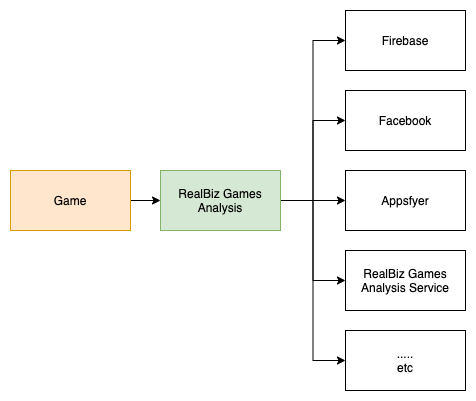

# I. Introduction

## 1. Goals
1. Centralize Analytics Logic.
2. Easy to hire developer to develop games, they don't care about 3rd-party Analytics SDKs.
3. Easy to us for Enable/Disable 3rd-party SDK. Just use [Script Define Symbols](https://docs.unity3d.com/Manual/PlatformDependentCompilation.html)
4. Easy to add more 3rd-party SDK when we need more. Just implement in Reposotory-Layer. => We do not depend on Game Developer.

## 2. How does it works?
1. The Core of the Game use one easy API to record events and user's properties.
2. The Analysis Core send them (events + properties) to many 3rd-party that is desired.



## 3. How to achieve it?
- Using [Clean Architure](https://blog.cleancoder.com/uncle-bob/2012/08/13/the-clean-architecture.html)

# II. Analysis

### 1. User Behavior Analysis

#### 1.1 Definitions
1. Node: A node is an interactable component on the Game Scene. It can be a Button, an Image, a Lable, etc.
2. Edge: It is an ***Transition*** from a ***Node*** to ***Another Node***. An Edge will contains 3 parameters:

```
{
  "node": "The current node-name",
  "src": "The source that the user interact before",
  "time_bound": "miliseconds - the time moving between [src, node]"
}
```
#### 1.2 Implementation
1. Add ***ButtonAnalysisBehaviour*** into your Button in the Game Scene
2. Or implment the below code in your custom function

```
private void onButtonClicked()
{
    RealbizGames.Analysis.ButtonAnalysisDTO dto = new RealbizGames.Analysis.ButtonAnalysisDTO(ButtonName);
    RealbizGames.Analysis.AnalysisInstance.Instance.AnalysisService.Button_Click(dto);
}
```
### 2. Game Flow Analysis

Apply Clean Architecture, design Scalable Analytics Tool Supplier.
